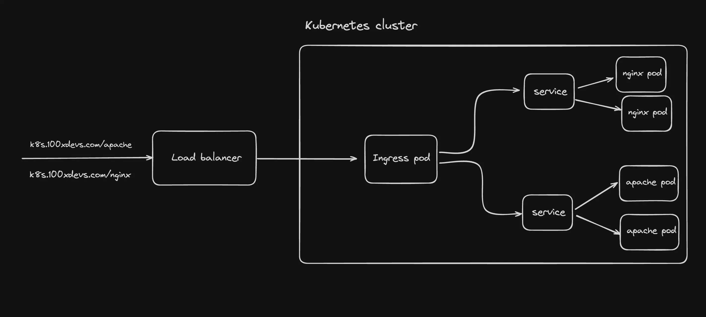

# **Complete Overview of Kubernetes Services**  

## **Introduction**  
In this video, I will give you a complete overview of Kubernetes services. First, I'll briefly explain what the service component is in Kubernetes and when we need it. Then, we'll go through the different service types:  

- **ClusterIP Service**  
- **Headless Service**  
- **NodePort Service**  
- **LoadBalancer Service**  

I will explain the differences between them and when to use each one. By the end of the video, you will have a great understanding of Kubernetes services and how to use them in practice.  

So, let's get started!  

---

## **What is a Service in Kubernetes and Why Do We Need It?**  

In a Kubernetes cluster, each pod gets its own **internal IP address**. However, pods are **ephemeral**, meaning they come and go frequently. When a pod restarts or an old one dies and a new one is created, it gets **a new IP address**.  

Using **pod IP addresses directly** doesn’t make sense because you would have to update them every time a pod gets recreated. This is where **Kubernetes services** come in.  

### **Key Benefits of a Service**  
- **Stable IP Address**: A service provides a persistent, static IP address that remains even when pods restart.  
- **Load Balancing**: If you have multiple replicas of a pod (e.g., three replicas of a microservice or a database), the service ensures requests are distributed among them.  
- **Loose Coupling**: Services enable communication between different components within the cluster as well as external services (e.g., browser requests or external databases).  

---

## **Types of Kubernetes Services**  

### **1. ClusterIP (Default Service Type)**  
This is the default service type in Kubernetes. If you don’t specify a service type when creating a service, Kubernetes automatically assigns it as **ClusterIP**.  

#### **How ClusterIP Works**  
Imagine you have a **microservice application** deployed in the cluster. The application runs in a pod, and the pod contains:  
1. **Microservice container (port 3000)**  
2. **Logging container (port 9000)**  

Each pod gets an **IP address from the node’s internal IP range**. If you have three worker nodes, each node receives a **range of IPs** for its pods.  

- Pod 1 (on Node 2) → `10.2.1.x`  
- Pod 2 (on Node 1) → `10.2.2.x`  

If we set **replica count to 2**, another identical pod is created with a different IP address.  

### **How Does ClusterIP Handle Requests?**  
1. **Ingress receives the request** from the browser.  
2. Ingress forwards the request to the **ClusterIP service** (internal service).  
3. The service then **routes the request** to one of its registered pod replicas.  

#### **How Does the Service Know Where to Route Requests?**  
- **Selectors:** The service identifies pods based on **labels**.  
- **Target Port:** Defines the **port inside the pod** to forward requests to.  

Each time a service is created, Kubernetes automatically creates an **Endpoints object** to track **which pods are part of the service**. This is dynamically updated when pods are created or removed.

---

### **2. Headless Service**  
A **headless service** allows clients to communicate with **specific pods directly** instead of routing traffic randomly like ClusterIP.  

#### **When Do We Need Headless Services?**  
- **Stateful applications** (e.g., MySQL, MongoDB, Elasticsearch).  
- Each pod has a unique **role** (e.g., master-worker setup in databases).  
- Pods need to **talk to each other directly** (e.g., database replication).  

#### **How Does a Headless Service Work?**  
- Instead of returning a **single ClusterIP**, the **DNS server returns the IP addresses of all pods**.  
- This allows clients to directly access individual pods.  

#### **How to Define a Headless Service?**  
- Set `clusterIP: None` in the service YAML file.  
- Kubernetes will **not assign a ClusterIP**, and DNS resolution will return **pod IPs instead**.  

---

### **3. NodePort Service**  
A **NodePort service** allows external traffic to reach the Kubernetes cluster by opening a **static port on each worker node**.  

#### **How NodePort Works**  
- **Each worker node** in the cluster exposes the service on a **port within the range 30000-32767**.  
- External clients can **access the service** using `<NodeIP>:<NodePort>`.  
- Kubernetes automatically creates a **ClusterIP service** that the NodePort forwards traffic to.  

#### **Limitations of NodePort**  
- Not very **secure** (opens ports on all nodes).  
- Not **efficient** for large-scale applications.  
- Best used for **quick testing**, not production.  

---

### **4. LoadBalancer Service**  
A **LoadBalancer service** is the most efficient way to expose a Kubernetes service externally.  

#### **How LoadBalancer Works**  
- It integrates with the **cloud provider’s** native **load balancer** (e.g., AWS, GCP, Azure).  
- Kubernetes automatically creates **NodePort and ClusterIP services** that the LoadBalancer routes traffic to.  
- The external **entry point** becomes the **cloud provider’s load balancer** instead of exposing worker nodes directly.  

#### **Key Benefits**  
- Secure and efficient.  
- Ideal for **production** environments.  
- Eliminates the need to manage **NodePort services manually**.  

---

## **Service Type Comparison**  

| **Service Type**  | **Use Case** | **Access** | **External Exposure** |
|-------------------|-------------|------------|------------------------|
| **ClusterIP**     | Internal communication | Within cluster only | ❌ No | 
| **Headless**      | Stateful apps (direct pod access) | DNS-based pod resolution | ❌ No |
| **NodePort**      | Expose service externally (testing) | Worker node IP + static port | ✅ Yes (via Node IP) |
| **LoadBalancer**  | Production-grade external access | Cloud Load Balancer | ✅ Yes (via cloud LB) |

---

## **Best Practices for Service Exposure**  
- **Use ClusterIP** for internal microservices.  
- **Use Headless Services** for stateful applications.  
- **Avoid NodePort** for production (use it for testing only).  
- **Use LoadBalancer** for external access in cloud environments.  
- **Use Ingress** for complex HTTP-based routing.  

---

## **Conclusion**  
We covered the **four types of Kubernetes services**, their differences, and when to use each one. Kubernetes services provide **stable networking**, **load balancing**, and **service discovery** to manage communication between components efficiently.  


Yes, you are absolutely **correct**!  

In Kubernetes, the **Controller Manager** runs a continuous **infinite control loop** to ensure that the **actual state** of the cluster matches the **desired state** defined by the user (in YAML manifests like Deployments, Services, etc.).

---

## **What is the Kubernetes Controller Manager?**
The **Kubernetes Controller Manager** is a component of the Kubernetes **control plane** that manages multiple **controllers**. These controllers are responsible for **monitoring** and **maintaining** the cluster’s state.

✅ It keeps checking if something is missing,  
✅ It fixes it if needed,  
✅ And it runs this logic **in an infinite loop**.

---

## **How Does the Controller Manager Work?**
Kubernetes follows a **declarative model**, meaning:  
- You **declare** what you want (e.g., 3 replicas of an Nginx pod).
- Kubernetes **makes sure** it happens (by running controllers).

It does this by running an **infinite reconciliation loop**:

1. **Observe the current state**  
   - The controller checks the current status of the cluster (e.g., how many pods are running).
  
2. **Compare it with the desired state**  
   - It looks at the desired state defined in the Deployment YAML.
  
3. **Take action if needed**  
   - If a pod is missing or crashed, it creates a new one.
   - If there are extra pods, it deletes them.

This loop runs **continuously**, ensuring the cluster is always in the correct state.

---

## **Different Controllers in Kubernetes**
The **Controller Manager** runs multiple controllers. Each controller has a specific job:

| **Controller**        | **Purpose** |
|----------------------|-------------|
| **Deployment Controller** | Ensures the correct number of pods in a Deployment. |
| **ReplicaSet Controller** | Ensures the correct number of replicas of a pod. |
| **Node Controller** | Monitors and replaces failed nodes. |
| **Job Controller** | Ensures Jobs complete successfully. |
| **Service Controller** | Manages Service endpoints. |
| **Persistent Volume Controller** | Manages Persistent Volumes for storage. |

### **Example: Deployment Controller in Action**
📌 You create a Deployment with **3 replicas**:
```yaml
apiVersion: apps/v1
kind: Deployment
metadata:
  name: nginx-deployment
spec:
  replicas: 3
  selector:
    matchLabels:
      app: nginx
  template:
    metadata:
      labels:
        app: nginx
    spec:
      containers:
        - name: nginx
          image: nginx
```

🔁 **What Happens in the Infinite Loop?**  
1. **Controller checks the current state**  
   - If all 3 pods are running, it does nothing. ✅  
   - If 1 pod crashes, it recreates it. 🔄  
   - If 5 pods exist (extra), it deletes 2 of them. ❌  

2. **The loop runs again continuously**  
   - It keeps checking to ensure there are always exactly 3 replicas.

---

## **What Happens When a Pod Dies?**
1. A pod running **nginx** crashes (or a node fails).  
2. The **ReplicaSet Controller** detects the missing pod.  
3. It immediately **creates a new pod** to maintain 3 replicas.  
4. The **new pod is scheduled** to an available node.  
5. The process repeats forever!

---

## **Key Takeaways**
✅ **Controller Manager runs an infinite loop.**  
✅ **It ensures Kubernetes is always in the correct state.**  
✅ **Different controllers manage Deployments, Nodes, Jobs, etc.**  
✅ **If something breaks, the controllers automatically fix it.**  

This is why Kubernetes is called **self-healing**—because controllers automatically restore the desired state without manual intervention. 🚀  

Do you want to dive deeper into a specific controller?

Ingresses--
___________
### **Why Use Ingress in Kubernetes?**  

In simple words, **Ingress** is like a traffic manager for your Kubernetes cluster. It helps expose your applications to the outside world in a controlled and efficient way.  

### **Why Did We Shift from Services to Ingress?**  

Originally, Kubernetes used **Services** (like NodePort and LoadBalancer) to expose applications. But these had limitations:  

1. **NodePort** → Opens a port on every node, but you have to manage domain names and SSL yourself.  
2. **LoadBalancer** → Creates a separate cloud load balancer for each service, which is costly and inefficient.  

**Ingress solves these problems by:**  
✅ **Acting as a single entry point** for multiple services.  
✅ **Managing routing** (send requests to different services based on URL paths).  
✅ **Handling SSL/TLS termination** (secure HTTPS traffic).  
✅ **Reducing cost** by using a single cloud load balancer instead of multiple.  

### **Conclusion**  
Instead of exposing each service separately, Ingress provides a single, centralized way to control traffic, making things **cheaper, more efficient, and easier to manage.** 🚀

kubectl get pods --all-namespaces

>kubectl get namespaces

### **Namespaces in Kubernetes – Explained Properly**  

#### **What is a Namespace in Kubernetes?**  
A **namespace** in Kubernetes is like a **virtual cluster** inside your actual cluster. It helps organize and manage different applications or teams by logically grouping resources.  

Think of it as **different folders** in your computer, where each folder has its own files but still exists on the same hard drive.  

---

### **Why Do We Need Namespaces?**  
1. **Better Organization** – Helps manage large clusters by grouping resources.  
2. **Resource Isolation** – Different teams or environments (dev, test, prod) don’t interfere with each other.  
3. **Access Control** – Restrict users or applications to specific namespaces.  
4. **Resource Limits** – Set CPU, memory, and other limits for different teams or projects.  

---

### **Example of Namespaces in Kubernetes**  
#### **1. Creating a Namespace**  
To create a namespace, use this YAML:  
```yaml
apiVersion: v1
kind: Namespace
metadata:
  name: dev
```
Or with `kubectl`:  
```sh
kubectl create namespace dev
```

---

#### **2. Deploying a Pod in a Namespace**  
By default, resources are created in the `default` namespace. To deploy in a specific namespace:  

```yaml
apiVersion: v1
kind: Pod
metadata:
  name: my-app
  namespace: dev
spec:
  containers:
  - name: my-container
    image: nginx
```

Or using `kubectl`:  
```sh
kubectl apply -f my-pod.yaml
```

---

#### **3. Listing Resources in a Namespace**  
To check all pods in the `dev` namespace:  
```sh
kubectl get pods -n dev
```

To check all namespaces:  
```sh
kubectl get namespaces
```

---

### **Common Namespaces in Kubernetes**  
Kubernetes has some built-in namespaces:  
- `default` → Where everything runs if no namespace is specified.  
- `kube-system` → Contains system resources like DNS, scheduler, controller-manager.  
- `kube-public` → Publicly available data, mostly for cluster discovery.  
- `kube-node-lease` → Helps with node heartbeat and health checks.  

---

### **Conclusion**  
Namespaces help organize, isolate, and manage resources in Kubernetes efficiently. They are **useful in large clusters** where multiple teams or projects share the same Kubernetes environment. 🚀


You're **mostly correct**, but let’s go step by step to clarify your understanding and refine it.

---

## **📌 Breaking Down Your Understanding**
1. **Frontend Deployment**
   - You create a **Deployment** for the frontend with multiple pods.
   - These pods communicate internally through a **ClusterIP service**.
   - The **ClusterIP service** allows frontend pods to talk to each other or expose an internal endpoint for Ingress.

2. **Backend Deployment**
   - Similar to frontend, you create a **Deployment** for the backend.
   - Backend pods are also exposed internally using a **ClusterIP service**.
   - The frontend interacts with the backend via this **ClusterIP**.

3. **Traffic Flow**
   - **User request → Load Balancer (LB) → Ingress Controller → Route to correct backend/frontend.**
   - The **Load Balancer** routes external traffic to the **Ingress Controller** inside the cluster.
   - The **Ingress Controller** decides where to send the request (frontend/backend) based on **path-based** or **host-based routing**.

---

## **📌 Are You Right?**
✅ **Yes, you're mostly correct!** But let’s clarify **Load Balancer vs Ingress** properly.

---

## **💡 Load Balancer vs Ingress**
| Feature | Load Balancer | Ingress |
|---------|--------------|---------|
| **Purpose** | Distributes traffic to a **single backend service** | Routes requests to multiple services (frontend/backend) based on rules |
| **Scope** | Targets **one** service (like backend) | Can manage multiple services (frontend, backend, etc.) |
| **Routing** | Routes based on availability of instances | Routes based on **URL path, host, or headers** |
| **Internal/External Traffic** | Usually for external traffic only | Handles both external & internal requests |
| **Configuration Complexity** | Simple but limited | More complex but flexible |

---

## **💡 Why Use Ingress Instead of a Load Balancer?**
### **1️⃣ Load Balancer (LB) Only:**
- If you **only** use an **external Load Balancer**, it can route traffic **only to a single backend service**.
- Example:  
  - `app.com` → Load Balancer → Backend service  
  - But what about frontend? You'd need **multiple Load Balancers** for multiple services, which is **expensive** in cloud environments.

### **2️⃣ Ingress (with LB):**
- Ingress acts as a **"smart router" inside the cluster**.
- You **only need one Load Balancer** (to forward traffic to Ingress).
- Ingress can then route:
  - `app.com/` → Frontend service
  - `app.com/api` → Backend service
  - `admin.app.com` → Admin panel service

🔹 **This avoids the need for multiple external Load Balancers.**  
🔹 **Ingress is more flexible and cost-efficient.**  

---

## **📌 Summary**
- ✅ **You are correct** in saying that **Load Balancer** directs traffic **only to a single backend**, while **Ingress can route traffic to multiple services (frontend, backend, etc.)**.
- ✅ Your understanding of **ClusterIP for internal communication** is **correct**.
- ✅ Your traffic flow understanding is **mostly right**, just remember that **Ingress is needed for smart routing** instead of having multiple Load Balancers.
- ✅ **Ingress + LB is the best approach** because **LB exposes the cluster, while Ingress handles the routing inside the cluster**.

---

🚀 **Final Thought:**  
With Ingress, you get **better traffic management, cost efficiency, and flexibility** in handling multiple services in Kubernetes. Let me know if you need further explanation! 🚀

## kubectl delete namespace ingress-nginx
## Helm repo remove ingress-nginx

## **🚀 Ingress Controller in Kubernetes: Deep Dive**  

### **1️⃣ What is an Ingress Controller?**  
- In Kubernetes, an **Ingress** is just a set of routing rules (it defines how traffic should reach different services).  
- But these rules **don't work by themselves**—you need a **component** that actually implements them.  
- That’s where the **Ingress Controller** comes in.  
- It listens for **Ingress resource definitions** and ensures traffic is routed accordingly.  

**Think of it like this:**  
📜 **Ingress = A traffic rulebook**  
🚦 **Ingress Controller = The traffic police that enforces the rulebook**  

---

### **2️⃣ Why Do We Need an Ingress Controller?**
💡 Kubernetes **doesn’t have built-in support** for handling Ingress rules.  
- Even if you define an Ingress, **nothing will happen** unless you have an **Ingress Controller** running.  
- It watches for new Ingress rules and sets up actual routing.

---

### **3️⃣ How Does It Work?**
1️⃣ A user creates an **Ingress** resource with rules (e.g., `/api → backend`, `/ → frontend`).  
2️⃣ The **Ingress Controller** sees this definition and configures a **reverse proxy** (like Nginx).  
3️⃣ Incoming traffic goes through the **Ingress Controller**, which forwards it to the right service.

---

## **🔹 Why Helm Came Into the Picture?**
Manually installing an Ingress Controller (like Nginx) requires:  
- Creating a Deployment for the controller  
- Managing RBAC (Role-Based Access Control)  
- Setting up ConfigMaps  
- Ensuring service discovery  

🔥 **Helm automates all of this!**  
- **Helm** is a package manager for Kubernetes, like `apt` for Linux or `npm` for Node.js.  
- It lets you install complex Kubernetes apps (like `nginx-ingress`) **easily with one command** instead of writing multiple YAML files.

---

## **🔹 Installing an Ingress Controller Using Helm**
### **1️⃣ Add the official Nginx Ingress Helm repository**
```bash
helm repo add ingress-nginx https://kubernetes.github.io/ingress-nginx
```
📌 This tells Helm where to find the **Nginx Ingress Controller** package.

---

### **2️⃣ Update the Helm repo**
```bash
helm repo update
```
📌 This ensures we get the latest version of the Nginx Ingress Controller.

---

### **3️⃣ Install the Nginx Ingress Controller**
```bash
helm install nginx-ingress ingress-nginx/ingress-nginx --namespace ingress-nginx --create-namespace
```
📌 This does several things:
- **Installs the Nginx Ingress Controller** in Kubernetes  
- **Creates a namespace** (`ingress-nginx`) for it  
- **Sets up necessary configurations automatically**  

---

## **🔹 Summary**
✔ **Ingress = Routing rules**  
✔ **Ingress Controller = Implements these rules**  
✔ **Helm = Makes installing and managing Ingress Controllers easier**  
✔ **Without an Ingress Controller, Ingress rules won’t work**  
✔ **Helm automates the setup, avoiding manual YAML configurations**  

🔥 **Final Thought:**  
Using an **Ingress Controller with Helm** is the best way to **simplify traffic management** in Kubernetes! 🚀 Let me know if you need more details.



See we use annotations in ingress --

 ## ** annotations:
    nginx.ingress.kubernetes.io/rewrite-target: /

    now this / means we will go to the / which is the landing page of that service 

## SIDECAR PATTErn

## 🚀 **Deep Dive into Kubernetes Services & Pods**  

### **1️⃣ Understanding Pods in Kubernetes**  
- A **Pod** is the smallest deployable unit in Kubernetes.  
- It usually **contains one container** but can have multiple if needed.  
- **Think of a Pod as a wrapper around a container** that provides networking & storage.  

📌 **Example:**  
If you build a **Node.js server**,  
- You create a **Docker image** of the Node.js app.  
- You deploy this image in Kubernetes as a **Pod**.  
- If you scale to 5 Pods, you now have **5 instances of your Node.js server** running.  

✔ **1 Pod = 1 instance of your server running**  
✔ **Multiple Pods = Multiple instances running (like a load-balanced backend)**  

---

### **2️⃣ Communication Between Pods (Why & How?)**  
- Kubernetes automatically assigns **each Pod its own private IP** inside the cluster.  
- But **Pod IPs are not stable**—if a Pod dies & restarts, it gets a new IP.  
- That’s why we use **Kubernetes Services** to provide **stable networking**.

---

## **🔹 Kubernetes Services (ClusterIP, NodePort, LoadBalancer)**  

### ✅ **1. ClusterIP (Default) → Internal Communication**  
- **Exposes a service inside the cluster** (not accessible from outside).  
- **Other Pods can communicate** with it via a **stable Cluster IP**.  
- Used for **backend-to-backend communication** (e.g., frontend calling backend).  

📌 **Example:**  
If you have a backend running in a Pod (`backend-pod`), you create a **ClusterIP service**:  
```yaml
apiVersion: v1
kind: Service
metadata:
  name: backend-service
spec:
  type: ClusterIP  # Default type, only accessible within the cluster
  selector:
    app: backend
  ports:
    - protocol: TCP
      port: 80       # Service Port
      targetPort: 3000  # Port inside the container
```
- Now, frontend Pods can access the backend via **`http://backend-service:80`**, instead of worrying about Pod IPs.

✔ **Use Case:** When one microservice needs to talk to another **inside the cluster**.

---

### ✅ **2. NodePort → Exposing a Service on a Node's IP**  
- Opens a **static port on every node** (default range: `30000-32767`).  
- You can access the service from **outside the cluster** using `NodeIP:NodePort`.  
- Not ideal for production since Node IPs might change.

📌 **Example:**
```yaml
apiVersion: v1
kind: Service
metadata:
  name: my-service
spec:
  type: NodePort
  selector:
    app: my-app
  ports:
    - protocol: TCP
      port: 80        # Service Port inside the cluster
      targetPort: 3000  # Port inside the container
      nodePort: 32000  # Port exposed on all nodes
```
- Now, if a node’s IP is `192.168.1.10`, the service is available at **`http://192.168.1.10:32000`**.  

✔ **Use Case:** Quick debugging & local testing.

---

### ✅ **3. LoadBalancer → External Access with Cloud Load Balancer**  
- Creates a **public-facing load balancer** (e.g., AWS ELB, GCP LB).  
- Distributes traffic **automatically across Pods**.  
- Used when you need a **single entry point** for external users.  

📌 **Example:**
```yaml
apiVersion: v1
kind: Service
metadata:
  name: my-service
spec:
  type: LoadBalancer  # Exposes externally
  selector:
    app: my-app
  ports:
    - protocol: TCP
      port: 80
      targetPort: 3000
```
- Kubernetes will automatically create a **cloud load balancer** (AWS, GCP, etc.).
- Users can access it via the **public IP of the load balancer**.

✔ **Use Case:** Making a service **publicly accessible** with **load balancing**.

---

## **🔹 Summary & Key Takeaways**  
| Service Type    | Scope  | Accessibility | Use Case  |
|---------------|--------|-------------|-------------|
| **ClusterIP**  | Internal | Inside Cluster Only | Microservice-to-Microservice Communication |
| **NodePort**   | External | `NodeIP:Port` | Quick Access for Debugging |
| **LoadBalancer** | External | Public IP Assigned | Production, External Access |

🔥 **Final Thought:**  
✔ Pods are **containers running inside Kubernetes**.  
✔ Multiple Pods = **Multiple instances of your app running**.  
✔ Services **provide stable networking** & expose apps to other services or the internet.  
✔ **Ingress + LoadBalancer is the best combo** for handling external traffic.

Let me know if anything needs further explanation! 🚀


### **Why Do We Need ClusterIP If Pods Already Have IPs?**  

Yes, a Pod has its own **IP address**, and technically, another Pod **can** directly access it.  
**BUT… there are major problems with this approach.**  

---

### **🚨 Problem 1: Pod IPs Are Not Stable**  
- **Pods are ephemeral**—they can be **killed, restarted, or rescheduled** on a different node.  
- When this happens, **a new Pod gets a new IP**.  
- If you hardcode Pod IPs in your frontend or other services, **your system breaks** when a Pod restarts.  

📌 **Example:**  
- You have a **backend Pod** running at `10.244.1.23`.  
- Your frontend sends requests to `http://10.244.1.23:3000`.  
- If the backend Pod crashes and restarts, its new IP might be `10.244.2.45`.  
- Now, the frontend **doesn’t know the new IP**—so it **fails** to communicate.  

✔ **Solution:** **ClusterIP provides a stable DNS name instead of an unstable Pod IP.**

---

### **🚨 Problem 2: Load Balancing Between Pods**  
- What if you **scale your backend** to **multiple Pods**?  
- Your frontend needs to **randomly distribute requests** between backend Pods.  
- If you access a Pod **directly**, there’s **no built-in load balancing**.  

📌 **Example:**  
- You scale up **3 backend Pods**:
  - `10.244.1.23`
  - `10.244.1.24`
  - `10.244.1.25`
- How does the frontend **know which Pod to call**?  
- If you **manually rotate between them**, it’s inefficient.  

✔ **Solution:** A ClusterIP **automatically load balances** traffic across multiple Pods.  

---

### **✅ Solution: ClusterIP Service**  
- ClusterIP **provides a stable IP and DNS name** (e.g., `backend-service`).  
- It automatically **routes requests to available Pods** (load balancing).  

📌 **How It Works:**  
1. Instead of calling a Pod directly (`10.244.1.23`),  
   🔹 Call `http://backend-service:80` (ClusterIP).  
2. The request **gets routed automatically** to one of the backend Pods.  
3. Even if a Pod dies and a new one comes up, the service **remains stable**.  

✔ **This ensures fault tolerance & automatic scaling support.**  

---

### **🔹 Final Summary: Why ClusterIP?**  
| Problem | Without ClusterIP | With ClusterIP |
|---------|-----------------|---------------|
| **Pod IP changes** when restarted | App breaks | Service remains stable |
| **Load balancing** across multiple Pods | Not possible | Automatic |
| **Service discovery** | Must track IPs manually | Use a stable DNS (`backend-service`) |
| **Scaling** | Needs manual updates | Automatically adjusts |

🚀 **ClusterIP solves dynamic Pod IPs & load balancing, making Kubernetes networking scalable & fault-tolerant.**


**Exactly!** ✅  

When you create a **ClusterIP**, you get **one stable IP and DNS name** (e.g., `backend-service`).  

### 🔹 **How It Works:**  
1. Each **Pod** still has its **own unique IP** (e.g., `10.244.1.23`, `10.244.1.24`, etc.).  
2. But instead of hitting the Pod directly, your frontend calls **the ClusterIP** (`backend-service`).  
3. The ClusterIP **forwards the request** to an available Pod (load balancing between them).  
4. Even if a Pod **dies & restarts with a new IP**, the **ClusterIP remains the same**—so the frontend never needs to update anything.  

---

### 🔥 **Example**  
🚀 **Backend Pods:**  
| Pod Name  | Pod IP |
|-----------|---------|
| backend-1 | `10.244.1.23` |
| backend-2 | `10.244.1.24` |
| backend-3 | `10.244.1.25` |

📌 **ClusterIP Service (`backend-service`)** → Points to all backend Pods.  

✅ **Frontend Calls:**  
- Instead of calling `10.244.1.23:3000`, `10.244.1.24:3000`, etc.,  
- It simply calls **`http://backend-service:3000`**  
- The request is automatically forwarded to one of the backend Pods.  

---

### **💡 Why This is Important?**
✔ **No need to track Pod IPs manually** (they change often).  
✔ **Automatic load balancing** across multiple Pods.  
✔ **Ensures stability & scalability** when new Pods are added or removed.  

🚀 **This is the foundation of Kubernetes service discovery!**

Yes! A **single Pod** in Kubernetes can run **multiple containers** inside it.  

---

## 🔹 **How Can a Pod Have Multiple Containers?**  
A **Pod** is like a **small virtual machine** that can **contain multiple containers**. These containers **share**:  
✔ **Same Network (IP Address & Port Space)**  
✔ **Same Storage (Volumes)**  
✔ **Same Lifecycle (Start, Restart, Stop Together)**  

This is useful when **containers need to work closely together** (e.g., one app container + one helper container).

---

## 🔥 **Real-Life Example: Nginx + Sidecar Logger**
📌 Suppose you have a **Node.js API** running inside a container, and you want to log all requests using a separate **logging container**.  
Instead of handling logging inside the main app, we use a **Sidecar container** for logs.

### **Pod with Two Containers**
| Pod Name     | Container Name   | Function |
|-------------|----------------|-----------|
| my-app-pod  | `node-app`      | Runs the Node.js API |
| my-app-pod  | `log-collector` | Collects and sends logs to an external server |

---

### 🛠 **Kubernetes YAML Example**
```yaml
apiVersion: v1
kind: Pod
metadata:
  name: multi-container-pod
spec:
  containers:
  - name: node-app
    image: node:18
    ports:
    - containerPort: 3000
  - name: log-collector
    image: busybox
    command: ["sh", "-c", "while true; do echo 'Logging requests...'; sleep 5; done"]
```

### **How it Works?**
- The `node-app` container serves an API.
- The `log-collector` container runs a simple script that **logs requests every 5 seconds**.
- Both containers **share the same network** inside the Pod.
- The log container can access the Node.js app's logs via shared storage.

---

### 💡 **Why Use Multiple Containers in One Pod?**
✔ **Microservices Pattern:** Helps separate concerns (API + Logs).  
✔ **Efficiency:** Sidecar containers can handle **logging, monitoring, proxying, or caching** separately.  
✔ **Shared Storage & Network:** No need to expose ports or communicate over an external network.  

🚀 **This is called the "Sidecar Pattern"—commonly used in Kubernetes!**

### 🚀 **Understanding NodePort in Kubernetes**  

You're on the right track! Let's break it down properly.  

---

### **What is NodePort?**  
A **NodePort** service in Kubernetes allows external traffic to access a Pod **on a fixed port on every node in the cluster**.  

- By default, Kubernetes **Pods have their own IPs**, but these **aren’t directly accessible from outside the cluster**.  
- A **NodePort** service makes a Pod accessible **from outside the cluster** by opening a specific port **on all nodes**.  
- The request can then be routed to the correct Pod inside the cluster.

---

## 🎯 **How Does NodePort Work?**  

1️⃣ **When you create a NodePort service**, Kubernetes will:  
   ✅ Reserve a **static port (default range: 30000-32767)** on **each node** in the cluster.  
   ✅ Forward any traffic coming to that port to the **target Pod** inside the cluster.  
   ✅ Load balance across Pods if there are multiple instances.  

📌 **Example Scenario**:  
- You have a **Node.js API running in a Pod** inside a Kubernetes cluster.  
- You expose it using a **NodePort service**.  
- Kubernetes **assigns a NodePort**, e.g., `32000`.  
- Now, the API can be accessed from **any node’s IP** on that port.  

---

## 🛠 **NodePort Example (YAML)**
```yaml
apiVersion: v1
kind: Service
metadata:
  name: my-nodeport-service
spec:
  type: NodePort  # Exposes service on a node port
  selector:
    app: my-app
  ports:
    - protocol: TCP
      port: 80        # Service port inside the cluster
      targetPort: 3000 # Port inside the Pod
      nodePort: 32000  # Exposed port on each node (optional, auto-assigned if not set)
```
🔹 This means:  
- The Pod **runs the app on port `3000`**.  
- The service **routes traffic from port `80` (inside cluster) to `3000`**.  
- The app **is exposed externally on `32000`** on **every node in the cluster**.  

---

## 🔥 **Accessing the App via NodePort**
If your Kubernetes nodes have these IPs:  
📍 Node 1 → `192.168.1.10`  
📍 Node 2 → `192.168.1.11`  

You can now access the app via:  
```bash
http://192.168.1.10:32000
http://192.168.1.11:32000
```
✅ The request will be routed to the correct Pod inside the cluster.  

---

## **💡 When to Use NodePort?**
✔ When you **need external access** without using a LoadBalancer.  
✔ When you **have multiple nodes** and need access **from any of them**.  
✔ When using **bare metal Kubernetes clusters** (without cloud provider support).  

❌ **When NOT to use NodePort?**  
⛔ If you need a **more scalable solution** → use an **Ingress Controller** or **LoadBalancer**.  
⛔ If you want a **single fixed external IP** → LoadBalancer is better.  

---

### 🎯 **NodePort vs. LoadBalancer vs. ClusterIP**
| Service Type | Accessible From | Use Case |
|-------------|---------------|-----------|
| **ClusterIP** | Inside Cluster Only | Internal communication between Pods |
| **NodePort** | External & Internal (each node's IP) | Simple external access when LoadBalancer isn’t available |
| **LoadBalancer** | External & Internal (single external IP) | Best for production, auto-scales, and manages external traffic |

---

## **📌 Summary**
✅ **NodePort** lets you access a Pod **externally** via a static port on all nodes.  
✅ Best for **small setups or testing** when a **LoadBalancer isn’t available**.  
✅ Works **well with multiple clusters** when combined with external DNS or reverse proxy.  
✅ **Not the best** for large-scale applications—Ingress or LoadBalancer is preferred.  

🚀 **Hope this clarifies NodePort! Let me know if you need more details.** 😃

 